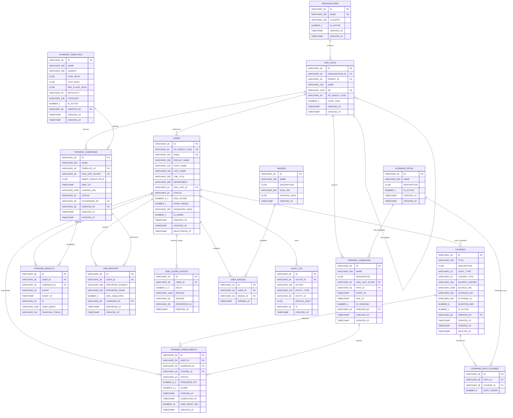

# eLearning AgroAmérica — Diagrama Entidad-Relación
## Base de datos: Oracle Database 19c Standard Edition 2

---

## Diagrama ER (Mermaid)

---

## Resumen de Entidades (16 tablas)

| # | Tabla | Descripción | Registros estimados |
|---|---|---|---|
| 1 | ORGANIZATIONS | Empresas del grupo AgroAmérica | 5-10 |
| 2 | ORG_UNITS | Unidades organizacionales del AD | 50-200 |
| 3 | USERS | Usuarios (sincronizados desde AD) | 800-5,000 |
| 4 | COURSES | Catálogo de capacitaciones | 50-500 |
| 5 | LEARNING_PATHS | Rutas de aprendizaje | 10-50 |
| 6 | LEARNING_PATH_COURSES | Cursos dentro de rutas (puente) | 100-500 |
| 7 | TRAINING_CAMPAIGNS | Campañas de capacitación | 20-100 |
| 8 | TRAINING_ENROLLMENTS | Matrículas/progreso de usuarios | 5,000-50,000 |
| 9 | PHISHING_TEMPLATES | Plantillas de phishing simulado | 20-100 |
| 10 | PHISHING_CAMPAIGNS | Campañas de phishing | 50-200 |
| 11 | PHISHING_RESULTS | Eventos de tracking | 5,000-50,000 |
| 12 | PAB_REPORTS | Reportes del Phish Alert Button | 500-5,000 |
| 13 | RISK_SCORE_EVENTS | Log inmutable de risk score (BASC) | 10,000-100,000 |
| 14 | BADGES | Insignias de gamificación | 10-30 |
| 15 | USER_BADGES | Insignias otorgadas | 1,000-10,000 |
| 16 | AUDIT_LOG | Registro de auditoría BASC | 50,000-500,000 |

---

## Cardinalidades

| Relación | Tipo | Descripción |
|---|---|---|
| ORGANIZATIONS → ORG_UNITS | 1:N | Cada empresa tiene múltiples OUs |
| ORG_UNITS → ORG_UNITS | 1:N | Jerarquía padre-hijo (auto-referencia) |
| ORG_UNITS → USERS | 1:N | Cada OU tiene múltiples usuarios |
| USERS → TRAINING_ENROLLMENTS | 1:N | Un usuario tiene muchas matrículas |
| USERS → PHISHING_RESULTS | 1:N | Un usuario tiene muchos eventos de tracking |
| USERS → RISK_SCORE_EVENTS | 1:N | Historial inmutable de cambios de riesgo |
| USERS → PAB_REPORTS | 1:N | Un usuario puede reportar muchos correos |
| USERS → USER_BADGES | 1:N | Un usuario gana múltiples insignias |
| COURSES → TRAINING_ENROLLMENTS | 1:N | Un curso tiene muchos matriculados |
| LEARNING_PATHS → LEARNING_PATH_COURSES | 1:N | Una ruta tiene cursos ordenados |
| TRAINING_CAMPAIGNS → TRAINING_ENROLLMENTS | 1:N | Una campaña genera matrículas |
| PHISHING_TEMPLATES → PHISHING_CAMPAIGNS | 1:N | Una plantilla se usa en varias campañas |
| PHISHING_CAMPAIGNS → PHISHING_RESULTS | 1:N | Una campaña genera eventos de tracking |
| BADGES → USER_BADGES | 1:N | Una insignia se otorga a muchos usuarios |

---

## Vistas Materializadas (4)

| Vista | Descripción | Refresh |
|---|---|---|
| MV_OU_RISK | Riesgo promedio por unidad organizacional | Cada hora |
| MV_ORG_RISK | Riesgo promedio por organización | Cada hora |
| MV_CAMPAIGN_STATS | Estadísticas de campañas de phishing | Cada hora |
| MV_TRAINING_PROGRESS | Progreso de capacitación por OU | Cada hora |

---

## Packages PL/SQL (4)

| Package | Descripción |
|---|---|
| PKG_RISK_ENGINE | Motor de riesgo con decay exponencial |
| PKG_ANALYTICS | Refresh de vistas y consultas de dashboard |
| PKG_AUDIT | Registro de auditoría (autonomous transaction) |
| PKG_AD_SYNC | Sincronización con Active Directory |
